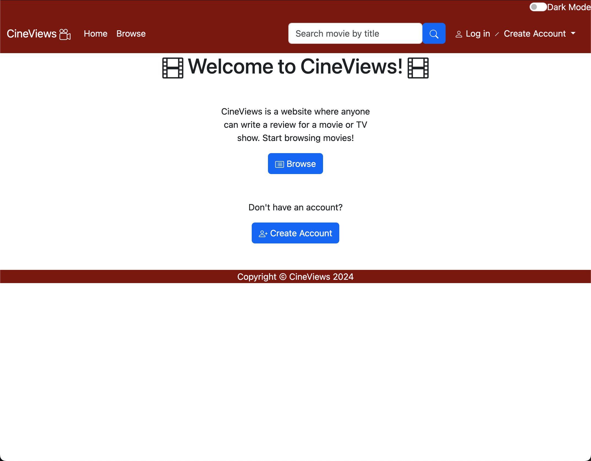
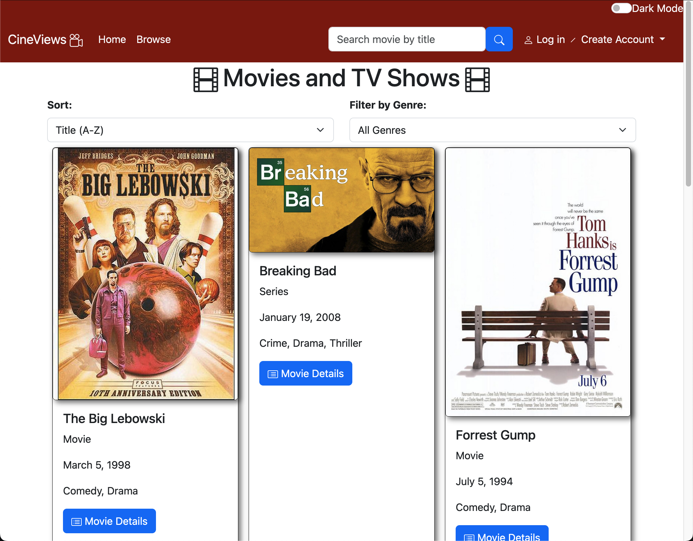
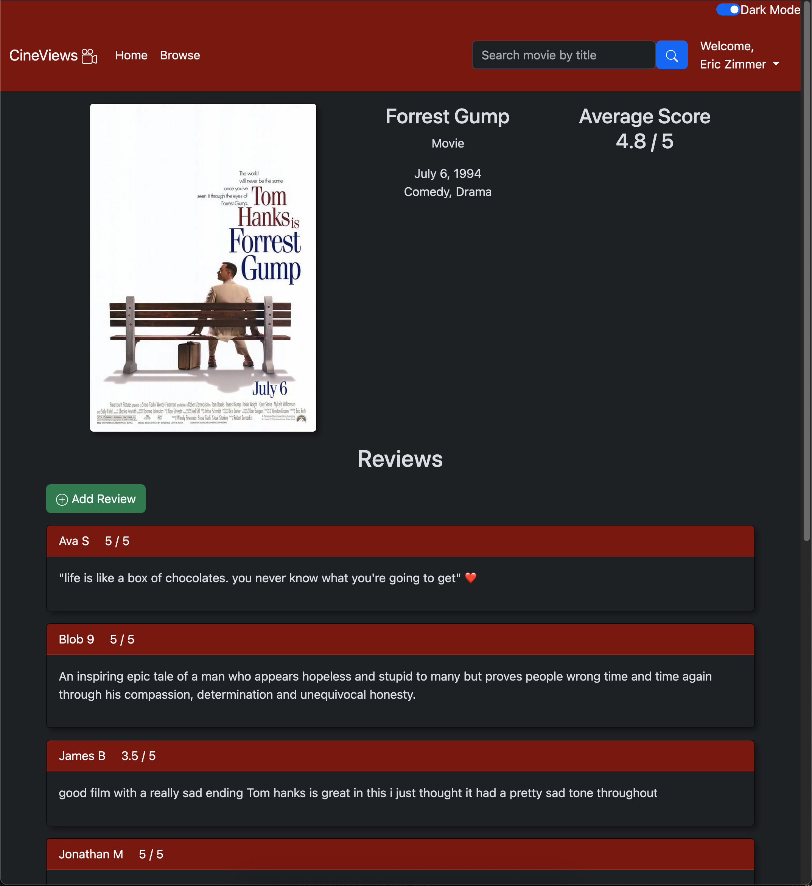
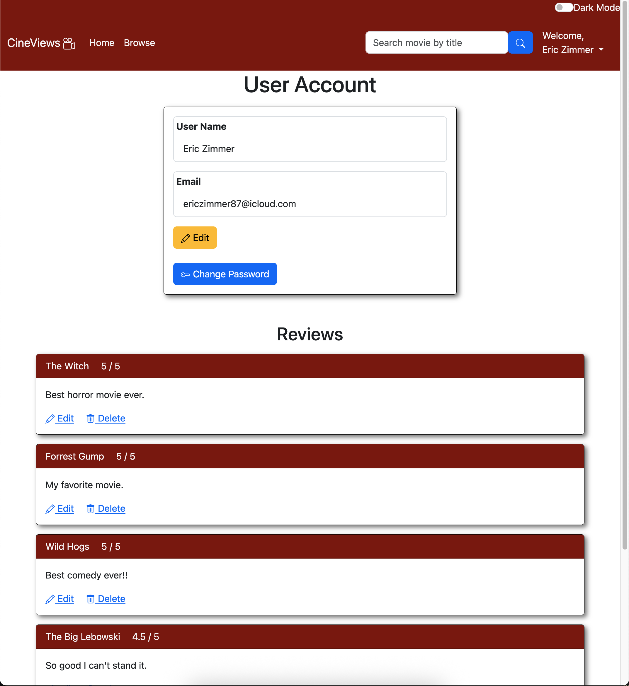
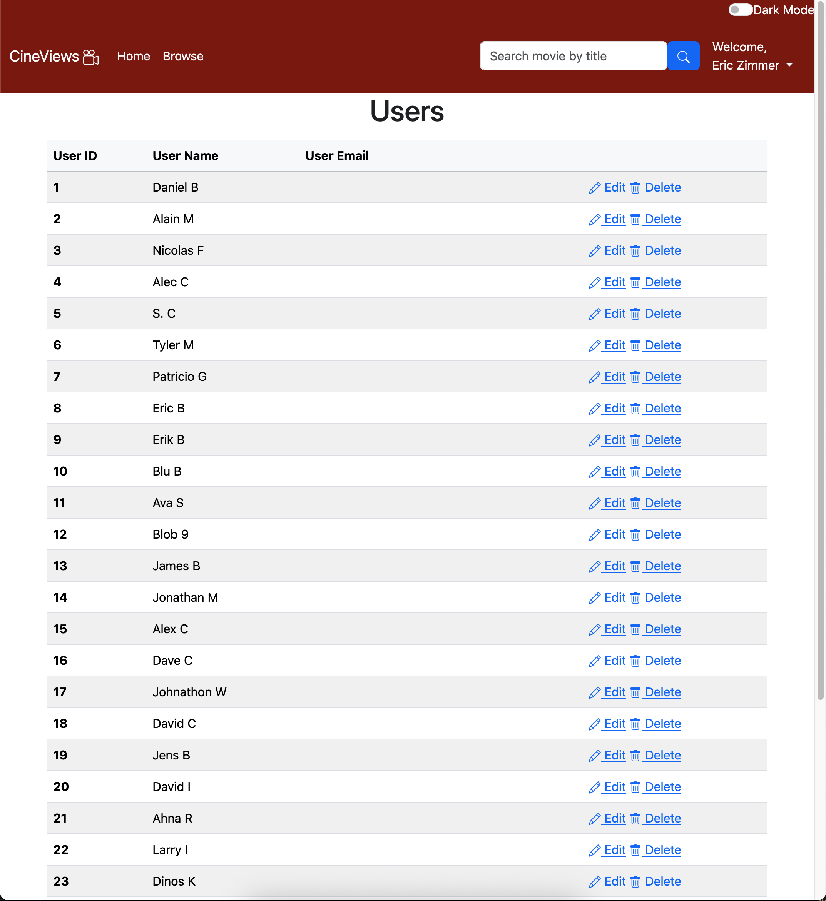

# CineViews – Full-Stack Movie Review Platform

CineViews is a full-featured movie review web application where users can browse movies, read/write reviews, and see community ratings. It includes secure user authentication, admin-only routes for managing movies and genres, and a full password reset system with expiring tokens via email.

This project was built from scratch using raw PHP, AltoRouter, Plates (PHP template engine), and MySQL — as a semester-long capstone at Central Community College. It earned **perfect scores across all evaluation stages** and **high praise from the instructor**. The full site was completed in ~2–3 weeks.

## 🌐 Live Demo

[https://ejzimmer.com/CineViews/](https://ejzimmer.com/CineViews/)

> **Note:** Sample images and reviews have been removed due to copyright concerns.

## Features

- Secure user registration & login system
- Strong password validation (length, complexity, etc.)
- Password reset system with token-based links & expiration
- Emails sent via mail() with secure reset links
- Movie listing, search, detail views, and reviews
- Average ratings from all user reviews
- Users can leave reviews once logged in
- Admin-only access for:
  - Adding/editing/deleting movies
  - Managing genres
- Built with AltoRouter + Plates for clean MVC-style separation
- Database access with PDO + prepared statements
- Responsive UI with Bootstrap

## Tech Stack

| Layer         | Tech                          |
|---------------|-------------------------------|
| Frontend      | HTML, CSS (Bootstrap), JS     |
| Templating    | Plates (PHP template engine)  |
| Routing       | AltoRouter                    |
| Backend       | PHP 8                         |
| Database      | MySQL + PDO                   |
| Auth          | PHP Sessions                  |
| Email         | PHP mail() function           |

## Dependency Management (Composer)

This project uses Composer to manage dependencies. Required packages include:

- [`altorouter/altorouter`](https://github.com/dannyvankooten/AltoRouter) – lightweight routing library
- [`league/plates`](https://platesphp.com/) – native PHP templating engine

To install dependencies, run:

```bash
composer install
```

## Structure
```
CineViews/
├── index.php                     # Main router and route map (AltoRouter)
├── database.php                  # All DB interaction functions
├── templates/                    # All Plates-based views
├── vendor/                       # Altorouter, Composer, League, and Templates
├── .htaccess                     # Redirects all non-file requests to index.php (for clean routing)
├── composer.json                 # Lists required PHP packages and project metadata
├── composer.lock                 # Locks exact package versions to ensure consistency
├── SQL_Create_Insert_Script.sql  # SQL script used to initially create the database with sample data
├── user_read.ini                 # DB creds (excluded from repo)
├── user_edit.ini                 # DB creds (excluded from repo)
├── README.md                     # You’re reading it
```

> **Note:** Most of the core logic can be found in:
> - `index.php` – main routing logic and route definitions
> - `database.php` – all database interaction functions
> - `templates/` – all HTML views and dynamic content using Plates templating

## Security & Validation

- Input validation for all user fields
- Password hashing via password_hash()
- Password verification via password_verify()
- Token expiration logic for reset links
- Session-based admin-only gating for privileged routes
- SQL injection protection via prepare() + execute()

## Screenshots

### Homepage


### Browse Page


### Movie Details Page


### User Account Page


### Users Page (Admin Only)


## Developer

**Eric Zimmer**  
Computer Science Student – Central Community College / Bellevue University  
- Built this entire site solo in under 3 weeks  
- Received perfect marks and instructor commendation  
- Continues to learn full-stack, systems, and secure backend development

---

## Notes

- This repo does not include the user_read.ini and user_edit.ini files for security reasons. To run locally, create those files with the appropriate MySQL credentials.
